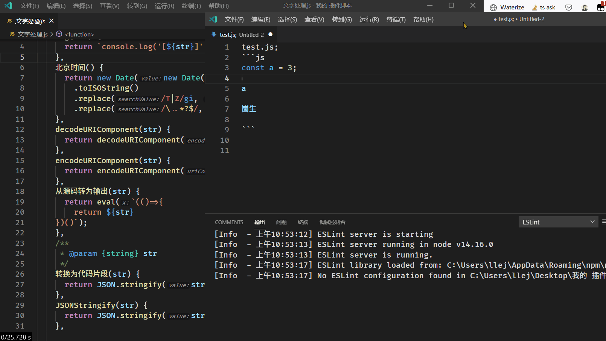

# code-transform README

可自定义代码逻辑来转换选中（或者光标所在行）的代码 (可多选)

------------
## 演示



## 命令

### setFun 设置转换函数

> 个人建议：使用 ctrl+e 的快捷键绑定 setFun 在使用的时候最舒服

运行这个命令之后去选择你自己写的一个或者多个js文件

例如：注释.js

```javascript
() => {
    return {
        /** 将 // 注释转换为/** 模式的注释 */
        getText(str) {
            return str.replace(/^(?=\s*)\/\//, "/**").replace(/$/, " */")
        },
        //... 其他的转换函数
    }
}
```

## [支持 gogocode 的转换](https://github.com/2234839/code-transform/issues/9)

```javascript
({gogocode:$}) => ({
    test(code) {
        console.log($(code));
        return $(code).replace('a', 'c').generate();
    }
});
```
### 演示


## 个人常用 js

file: 文字处理.js
```javascript
() => {
  return {
    log(str) {
      return `console.log('[${str}]',${str})`;
    },
    北京时间() {
      return new Date(new Date().setHours(new Date().getHours() + 8))
        .toISOString()
        .replace(/T|Z/gi, " ")
        .replace(/\..*?$/, "");
    },
    decodeURIComponent(str) {
      return decodeURIComponent(str);
    },
    encodeURIComponent(str) {
      return encodeURIComponent(str);
    },
    从源码转为输出(str) {
      return eval(`(()=>{
        return ${str}
    })()`);
    },
    /**
     * @param {string} str
     */
    转换为代码片段(str) {
      return JSON.stringify(str.split("\n"));
    },
    JSONStringify(str) {
      return JSON.stringify(str);
    },

  };
}
```