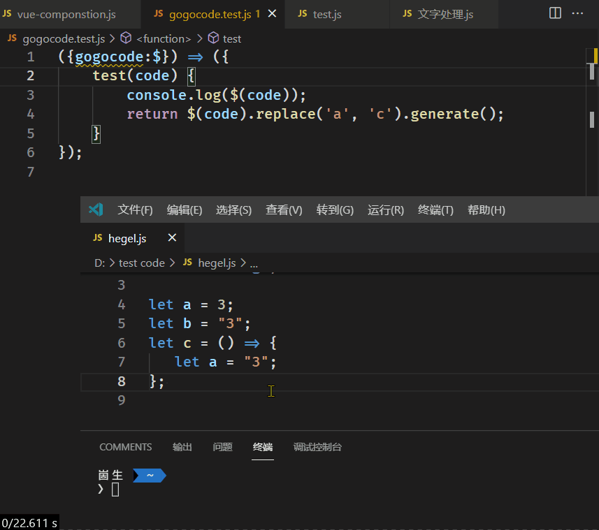

# code-transform README

可自定义代码逻辑来转换选中（或者光标所在行）的代码

------------
## 演示



## 命令

### setFun 设置转换函数

运行这个命令之后去选择你自己写的一个或者多个js文件

例如：注释.js

```javascript
() => {
    return {
        /** 将 // 注释转换为/** 模式的注释 */
        getText(str) {
            return str.replace(/^(?=\s*)\/\//, "/**").replace(/$/, " */")
        },
        //... 其他的转换函数
    }
}
```

## [支持 gogocode 的转换](https://github.com/2234839/code-transform/issues/9)

```javascript
({gogocode:$}) => ({
    test(code) {
        console.log($(code));
        return $(code).replace('a', 'c').generate();
    }
});
```
### transform 转换代码

运行这个命令选择你的函数，会将所有选中的代码（或者光标所在行的代码）作为输入传递给你的函数，然后替换为你函数的输出
